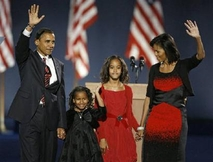

~ *[A.H. Jaffor Ullah](https://gold.mukto-mona.com/Articles/jaffor/index.html)*

Conquering some insurmountable odds Obama beat Senator John McCain on November 4, 2008.  It was definitely a history making event in America.  Barack Obama, a virtually unknown entity in American politics who came to Washington in 2006 as a senator, had rapidly ascended to the highest position beating all the odds.  He would be sworn as the 44th president of America on January 20, 2009.

The Associated Press writer Ron Fournier wrote that Obama's transcendence is beyond race. Hardly a few years ago it was unthinkable to elect a man of color to White House.  Nonetheless, it happened.  This is definitely a once in a life-time event. 

About 20 months ago, Barack Obama went to small towns in Iowa expressing an interest to run for the Democratic primaries.  He gave the Iowans a vision for tomorrow, they liked his idea, gave him small donations, and he started a campaign that culminated on November 4, 2008.  The path to White House was tortuous to say the least.  Nonetheless, his message went through and finally he became the nominee of the Democratic Party beating one of the most popular candidates of our time, Senator Hillary Clinton.

As the day wore by, the campaign for White House became a nasty one.  The Republican candidate and his surrogates threw all the epithets on him and he braved those insults with a smiling face.  Then the news of economic meltdown in the Wall Street came in September 2008.  This cataclysmic event catapulted Obama to stratospheric height because he remained calm and listened to the expert.  He then went to Washington meeting with the president and his colleague at the senate.  This contrasted with that of Senator McCain who behaved erratically.

Barack Obama's message of change struck a chord with the American voters who saw how the nation suffered in the hands of Bush and Cheney.  The government's expense was rising, the budget deficit was escalating, and people's standard of living was heading down due to a rapid inflation in the prices of everyday commodities including that of energy cost.  The common ordinary people were facing economic hardship while the government of Bush-Cheney remained nonchalance. The popularity poll of George W. Bush plummeted all time low and it affected the campaign of John McCain who the voters thought to be a clone of the president who belonged to the same party.  In essence, the political philosophy of George W. Bush and John McCain was virtually the same.

About 3 million ordinary people of America have funded Barack Obama's political campaign.  After receiving the news of the victory, Obama wrote this e-mail to his donors and supporters.  It came to my mail box right before he gave the victory speech at Grant Park, Chicago on November 4 and it reads as follows:

> "I'm about to head to Grant Park to talk to everyone gathered there, but I wanted to write to you first. We just made history. And I don't want you to forget how we did it. You made history every single day during this campaign -- every day you knocked on doors, made a donation, or talked to your family, friends, and neighbors about why you believe it's time for change. I want to thank all of you who gave your time, talent, and passion to this campaign. We have a lot of work to do to get our country back on track, and I'll be in touch soon about what comes next. But I want to be very clear about one thing... All of this happened because of you. Thank you, Barack"

At CNN's Election Night coverage there were quite a few Republican analysts.  One of them, William Bennett, said that Obama ran a very impressive and flawless campaign.  Most analysts have opined that they have never seen such a campaign that did not make any error.  Also, Obama used the Internet to the fullest extent.  The campaign never had any problem getting donations from supporters.  It was truly an Internet-based grassroots movement.

Obama's message of change had touched the hearts and minds of Americans of all walks of life.  He was able to build a coalition of voters from minority folks, younger generation, white collar Americans, and the Democratic base composed of factory workers, unionists, labor, etc.  They have responded to his call for a change in America. 

At the Victory speech given at Grant Park before 125,000 people, Obama promised to fulfill his election pledge.  He also said that he will need help and cooperation from ordinary Americans to build a better America.  It was a historic speech which will go down in the annals of American politics as one of the finest victory speeches given at any time.

Barack Obama is considered a visionary and transformative politician.  America needs a leader like him when bad times have fallen all across the nation.  He promised to bring a change in the way the government is run.  America is surely entering a new age with an African American president.  Let us hope that it is a new beginning not only for America but also for the world.

-----
*Dr. A.H. Jaffor Ullah* 

- A researcher and columnist, writes from New Orleans, USA*
