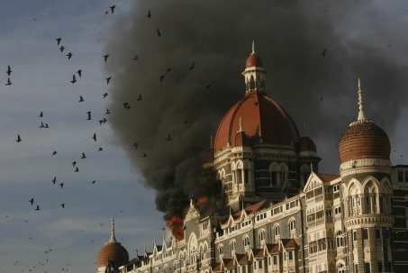

~ *[Abul Kasem](https://gold.mukto-mona.com/Articles/kasem/index.html)*  

At last, the mayhem in Mumbai has been halted. Sadly, about two hundred Indians and about twenty-two foreigners lost their lives. The consequence of this siege by a handful of Islamist jihadists was never in doubt. The Indian commando, once again, proved beyond a shadow of doubt who reigns supreme when the Allahs soldiers face the might of the professional military. These Islamist jihadists excel in only one art—the killing of hapless, unarmed, weak, innocent civilians.

It is a shame to Islam. Killing and maiming innocent, helpless, under any circumstances, is an act of unspeakable barbarity and gross criminality. That is why we have the International Convention on the conduct of warfare and the treatment of civilians, and the prisoners of war. Only Islam has no qualm murdering innocent people, simply because they are not Muslims. I read in today's newspaper (Sydney Morning Herald, December 1, 2008) that the jihadists spared the life of a Turkish Muslim man. The lone captured jihadist readily admitted that their mission was to kill at least five thousand non‑Muslims.

Thanks to the power and skill of the Indian commando, these Allah's fighters were subdued before they could harm more lives.

But their sponsors have got what they wanted most—the world-wide media attention.

Please note that about ten percent of the victims were foreigners, mostly people of white complexion. This tells us a chilling reminder:

To the jihadists the blood of a white westerner is more valuable than the blood of hundreds of non‑white, Indian or Pakistani or Bangladeshi. For example; in September this year the jihadists bombed Marriott hotel in Islamabad, killing fifty-three people, all most all of them Pakistanis, except for a couple of western white people. There were no British or American killed.

The result? This Marriott bombing did not have the extent of western media coverage that the jihadists were craving. It was just news, and that was all. The jihadists were disappointed—Pakistani blood was not that valuable for the Allah's killing machines.

Ditto for the bombing of Mariott Jakarta. The jihadists could not get the coverage they were after. The Indonesians' blood is cheap; the jihadists do not value them much.

In the last few months, the Indian Mujahiddin detonated a number of bombs in several crowded places of India, killing hundreds of Indians. This had little impact in the western media. The jihadists got the message. To attract world attention they must continue killing western white people, even a handful of them, one or two, will have far greater impact than killing tens and hundreds of hapless, impoverished, dark‑skinned Indians, Pakistanis or Bangladeshis.

Therefore, the jihadist mathematics says killing one white westerner is approximately equivalent to killing around twenty coloured/black people but with enormous impact in the world media. The Mumbai massacre proved just this. The attack on the Taj and the Jewish seminary had much news-coverage than the river of blood the jihadists created in the Chatrapati Shivaji railway station.

The intelligence agencies, the journalists, the terrorism analysts, the anti‑terrorist policy makers discovered new theories only after the jihadists have successfully conducted their operations that resulted in the killing of hundreds of civilians. These scholars and analysts are still perplexed why the Islamist terrorists are doing what they are doing. Their analyses range from Palestine, Kashmir, Indian communal riots (though, since time immoral, India has riots almost every month), immoral life styles of the Bollywood movie stars, the un‑Islamic attire worn by the Indian women, the unmet grievances of the local Muslims…and so on.

These savants will blame anything for Islamic mayhem except Islam itself. Even when the jihadists loudly proclaim that what they are doing is to implement Islam, these pundits blithely proclaim this terrorism has nothing to do with Islam. When the Islamist killers pronounce Koranic verses to justify their Islamic actions, these scholars and terrorism experts will maintain that Islam is a peaceful religion—these jihadists have distorted the peaceful Islam.

Even, as per the dicta of the Koran, when the Islamists are killing innocent people in India, the UN passes resolution banning the criticism of Islamic atrocities across the world. We must not spread Islamphobia, the secretary general of the UN told us, as if he is an expert on Islam. We wonder why Ban Ki-moon does not convert to Islam, since he is now the strongest protector of Islam.

This is just laughable.

There are a few other lessons we may learn from the Mumbai massacre:

- Killing a Jew is more valuable than killing a Hindu.
- The only language Islamist soldiers heed is the language of force and compulsion. Islam only respects a strong force
- Islam has no respect for human rights or human lives
- Terrorism is a tactic used to spread and subjugate the world to Islam
- Infidels are truly dumb when it comes to analysing Islamist terrorism. It appears the Koran is correct when it says that the infidels are deaf dumb and blind
- A vigorous offence is the best form of defence. Has India the clout to do what is needed to be done?
- A handful of Jihadists can, and will kill hundreds and thousands of innocent people. All that these intrepid jihadists need is a firm brainwash with the Koranic verses and the motivations from Muhammad's life.
- Since the blood of a western white person is valuable for Islam, it is better they avoid visiting and patronising Islamic paradises or places where Islamist jihadists are active.

To conclude: Islamist terrorism is not going to go away so soon. It will take time, massive military and non‑military efforts to exorcise the Islamist jihadists from their affliction to Islamic virus.

----
~ *[Abul Kasem](https://gold.mukto-mona.com/Articles/kasem/index.html) is an Bengali freethinker and is a teacher by profession. He has contributed in [*Leaving Islam – Apostates Speak Out*](https://www.amazon.com/Leaving-Islam-Apostates-Speak-Out/dp/1591020689) and [*Beyond Jihad – Critical Voices from Inside*](https://www.amazon.com/gp/product/1933146192). He has also written extensively on Islam in various websites and is the author of several e-Books including: A Complete Guide to Allah, Root of Terrorism ala Islamic Style, Sex and Sexuality in Islam, Who Authored the Quran? and Women in Islam. Mr. Kasem leaves in Sydney, Australia. His latest contribution is in the book [*Why We left Islam*](https://www.amazon.com/Why-We-Left-Islam-Muslims/dp/0979267102), edited by Susan Crimp et al.* He can be contacted at *abul88 at hotmail dot com* and *nirribilli at gmail dot com*

[this post on internet archive for mm enblog](http://web.archive.org/web/20100115162230/http://mukto-mona.com/wordpress/?p=35)