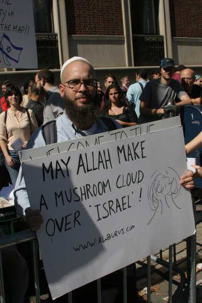

~ *[Syed Kamran Mirza](https://gold.mukto-mona.com/Articles/skm/index.html)*  

Answer to the above title is like the same question: Is the al-Qaeda a foe or friend of Islam?  It depends totally whom do we ask this question! If we ask some gullible law abiding so called moderate Muslims living mostly in the western nations, they will say: al-Qaeda is the enemy of Islam because these jihadi terrorists have hijacked peaceful Islam and they are tarnishing the prestige of Islam and Muslims.

On the contrary, if we ask all the Madrassha students (Talibans), mullahs, Imams, Maulanas, muftis, Kkari, Khatibs, all Islamic scholars, Imams of all grand Mosques etc—almost 100% of them will say: they all love al-Qaeda very much and they support them wholeheartedly. Almost 90% of all gullible Muslims living in the Muslim world (such as any Arab nations, Pakistan, Bangladesh or Sudan), they will answer that al-Qaeda is definitely friend of Islam. OBL is still the most popular Muslim hero in the Muslim world. When did anybody see any protesting/condemning demonstration by the Muslims of any country against al-Qaeda or OBL?  NEVER!

Where do they (al-Qaeda and other Islamic terrorists) get monetary support from?

It is needless to ask that all these Islamic terrorists definitely need millions of dollars to perform the 'Modus operandi' of their fanatic vicious killing games around the globe. Who gives them money? Do they earn money themselves? Absolutely not! They all get 100% of their monetary supply from pure Muslims around the world.  Al-Qaeda and it's offshoots, i.e., all the various jihadi terrorists groups under the disguise of different names get their 100% financial and logistic supports from many Islamic charity under the banner of charitable donations. Almost all the Mosques establish in the western kaffir-lands, there are several donating funds which are the great sources monetary support for Islamic terrorists. Besides, Saudi Arabia and many other Arab nations generously spend billions of their petro-dollars (each year to promote and expand religion Islam) from which a lion share goes to these terrorists' funds. Therefore, here is the ultimate answer how much Muslims love al-Qaeda and all jihadis and whether al-Qaeda is the great friend of Muslims or not!

Now, to get the real answer whether Muslims all over the world should condone or condemn Mumbai terrorism and mayhem—we should carefully read and listen to the incredible video in the following article (JAWA REPORT about RevolutionaryMuslims.com). Please do not miss to listen the video below:

American Muslims Justify, Equivocate Mumbai Massacre [UPDATED, Bumped]

*Samir Khan emerges from his parents' house in Charlotte, NC*

Our nemesis Samir Khan [aka, "inshallahshaheed"] over at the "[Ignored Puzzle Pieces of Knowledge](https://revolution.muslimpad.com/2008/11/28/mumbai-attacks)" is talking about the Mumbai massacre over at this blog. I don't think long time readers will be shocked that he offers *no words of condemnation. Only equivocation and justification.*

The crux of his argument is the same used by Salafist extremists of his ilk in their routine justification of al Qaeda and Taliban attacks on civilians:
> okay, so, you people kill innocent Muslims all the time. Classic equivocation.

Not content with equivocating, he then goes on to say why the Mumbai attacks might be justified. First, he goes to the general argument that violence is never justified:

We wouldn't take the words of Maulana Mahmood ul-Hasan Qasmi very seriously since he made a blunder when he said, "Islam never teaches anyone's to take somebody's life." He was upset at the idea of Deccan Mujahideen retaliating for his honor.

He then goes on to justify this particular massacre as legitimate if it brings the world's attention to the plight of Muslims in India:

All in all, **it could just be that the Indian Muslims need that massive international media recognition so that their demands are met** and at the same time, make the Indian population realize that the Hindu Massacres upon the Muslims is an ongoing threat and it needs to be solved now. Sure, **the situation may appear extreme in isolation, but when put in context, one can acknowledge the history of this conflict and how the Muslims of India have always been the "underdogs."**

*Joseph Cohen greets Mahmoud Ahmadinejad at Columbia*

Next, let's see what Jewish convert to Islam Joseph Cohen [aka, Youssef al-Khattab] has to say about the attack. Unlike his friend Samir Khan, who in the post above claims the attacks are the result of Indian policies, Cohen claims the attacks are the result of American policies.

You'll notice that Cohen says that he doesn't condone the Mumbai attacks, but then also goes out of his way to say the neither does he denounce it.

Pretty bad, eh? Just to clarify his non-condemnation, this exchange takes place on [Cohen's YouTube page](https://mypetjawa.mu.nu/archives/195176.php)

Politically Slow:
> You're NOT denouncing it?

RevolutionMuslimCom:
> Nope

But not as bad as the [comments other Muslims have made on his blog](https://www.revolutionmuslim.com/index.php?option=com_content&amp;view=article&amp;id=305:do-you-think-the-mumbai-attack-was-collateral-punishment-for-the-usa-and-britains-foreign-policies-&amp;catid=8:voicesoftheummah&amp;Itemid=9#yvComment). For instance "Salafiyyah" from Nigeria who it seems thinks Cohen is not strong enough in his support for the Indian massacre. Or Omar who proclaims:

Allahu akbar…May Allah aid and guide the mujahideen and help every other muslim male support the ummah of Muhammad(saws)

Or Bilal who claims to be from Britain and identifies himself with the followers of Omar Bakri Muhammad with the website [islam4uk.com](https://islam4uk.com)
 

It was pleasantly refreshing to hear they targeted Chabad Lubavitch. Allah will destroy His enemies wherever they are in the world. You will know when the Muslims have ignited in an insurrection when there is blood on the streets of London and New York like there is blood on the streets of Fallujah (and Mumbai). There is nowhere they can hide from the wrath of Allah and His soldiers.

Or Abu Aisha who, like Ayman al-Zawahiri, seems to be a Malcolm X fan:

The crimes of the kuffaar are coming back to haunt them. its chicken come home to roose

Islam: Religion of Peace.

Is it really so hard just to say: we unequivocally condemn the murders in Mumbai?

UPDATE: Via Stable Hand, just when you thought it couldn't get worse, from Joseph Cohen's forum: [Happy Thanksgiving: USA Blood Pudding Stuffing, dead jews in Bombay today, God Willing](https://www.revolutionmuslim.com/forum/index.php?showtopic=1349)

It is good to Give Thanks that jews may very well die as brother Bilal pointed out as the jewish from Crown Heights Brooklyn had set up occupation in that city as well and is now under threat of death in this lovely lovely and happy episode of a Thanksgivings Day adventure. Williamsburg and Crown Heights in New York are so well guarded even by their own Chasid jew police besides New York's police, and what with the islands and limited on and off access and the bridges you almost cannot imagine that a God Damned jew can be killed there. I'm glad they came to Bomb bay to hopefully, God Willing, be killed in it.

Oh, God……..
 

Please click to this URL to listen an incredible video: http://mypetjawa.mu.nu/archives/195176.php

-----
*Syed Kamran Mirza was born in a Muslim family of Bangladesh. After having Ph.D. in Biological science he worked as a teacher in the University in Bangladesh for a period of 12 years, now lives in USA. He is the author of the book, "Roots of Islamic Terrorism" published in 2004. And also authored more than 200 articles scrutinizing in various aspects of Islam, some of which have been published in the reputed journals. He can be reached at mirza.syed at gmail dot com*

[this post on internet archive for mm enblog](https://web.archive.org/web/20201024202305/http://enblog.mukto-mona.com/2008/12/05/will-muslims-all-over-the-world-condone-or-condemn-mumbai-terrorism)